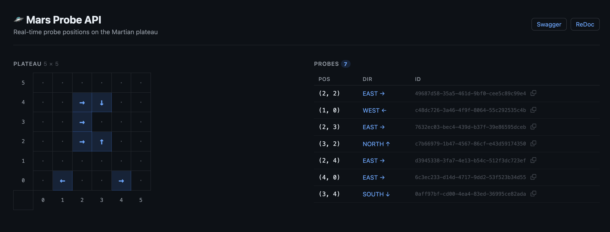

# Mars Probe API

API REST para controle de sondas exploradoras em um planalto retangular em Marte.



## Como rodar

**Pré-requisitos:** Python 3.12+ e `pip`.

```bash
python3 -m venv .venv
source .venv/bin/activate       # Windows: .venv\Scripts\activate
pip install -r requirements-dev.txt
uvicorn app.main:app --reload
```

Acesse `http://localhost:8000`.

**Com Docker:**

```bash
docker compose up --build
```

## Endpoints

| Método | Rota | Descrição |
|--------|------|-----------|
| `POST` | `/probes` | Lança uma sonda e configura o planalto |
| `POST` | `/probes/{id}/commands` | Envia comandos de movimento |
| `GET` | `/probes` | Lista todas as sondas |
| `GET` | `/probes/{id}` | Posição de uma sonda específica |
| `DELETE` | `/probes/{id}` | Remove uma sonda |
| `GET` | `/health` | Health check |

### Lançar sonda

```json
POST /probes
{ "x": 5, "y": 5, "direction": "NORTH" }

// 201
{ "id": "uuid", "x": 0, "y": 0, "direction": "NORTH" }
```

`x` e `y` são as coordenadas do canto superior direito do planalto. A sonda sempre pousa em `(0, 0)`.

### Enviar comandos

```json
POST /probes/{id}/commands
{ "commands": "MMRMM" }

// 200
{ "id": "uuid", "x": 2, "y": 2, "direction": "EAST" }
```

| Comando | Ação |
|---------|------|
| `M` | Avança uma posição |
| `L` | Gira 90° à esquerda |
| `R` | Gira 90° à direita |

## Testando manualmente

A API sobe com 7 sondas pré-carregadas num plateau `5 × 5`. Para lançar uma nova sem conflito, use `x` e `y` iguais ou maiores que `4`. Para testar o bloqueio de resize, use valores menores.

## Regras de negócio

- Sondas iniciam sempre em `(0, 0)`
- O planalto é compartilhado entre todas as sondas
- Comandos inválidos são rejeitados antes de qualquer execução
- Movimentos fora dos limites retornam `422`
- Sondas não encontradas retornam `404`

## Testes

```bash
pytest
```

Cobertura: 98%. Para relatório HTML:

```bash
pytest --cov=app --cov-report=html
```

## Decisões de design

**O plateau pode ser redimensionado, mas nunca de forma que coloque uma sonda fora dos limites.**
Cada lançamento pode redefinir as dimensões. Aumentar é sempre ok. Diminuir só falha se alguma sonda já estiver além do novo limite, e a API retorna `409`. Congelar no primeiro lançamento seria mais simples, mas impediria qualquer expansão futura.

**A sequência de comandos é validada antes de qualquer movimento.**
Se há um caractere inválido, nada é executado. O mesmo vale para colisões com o limite: ou todos os movimentos funcionam, ou nenhum é aplicado. Essa lógica vive na service, não só na camada HTTP, então se comporta da mesma forma em testes ou em qualquer outro contexto.

**O estado fica em memória e é perdido ao reiniciar.**
Limitação consciente para esse contexto. O padrão de repositório garante que, se precisar de banco de dados, só o repositório muda, sem tocar na lógica de negócio.

### Status HTTP

| Situação | Código |
|----------|--------|
| Probe criada | `201 Created` |
| Operação bem-sucedida | `200 OK` |
| Probe removida | `204 No Content` |
| Plateau encolheria e invalidaria sondas existentes | `409 Conflict` |
| Entrada inválida / comando ilegal / movimento fora dos limites | `422 Unprocessable Entity` |
| Probe não encontrada | `404 Not Found` |

## Stack

- **Python 3.12** / **FastAPI** / **Pydantic v2**
- **Pytest** com 98% de cobertura
- **Docker / Docker Compose**
- **Jinja2** para o mapa visual

## Estrutura

```
app/
├── controllers/   rotas FastAPI
├── services/      regras de negócio
├── repositories/  persistência em memória
├── models/        entidades e enums
├── schemas/       DTOs Pydantic
├── exceptions/    exceções de domínio
└── core/          config, DI e seeder
tests/
├── unit/          service e repository
└── integration/   endpoints via TestClient
```
